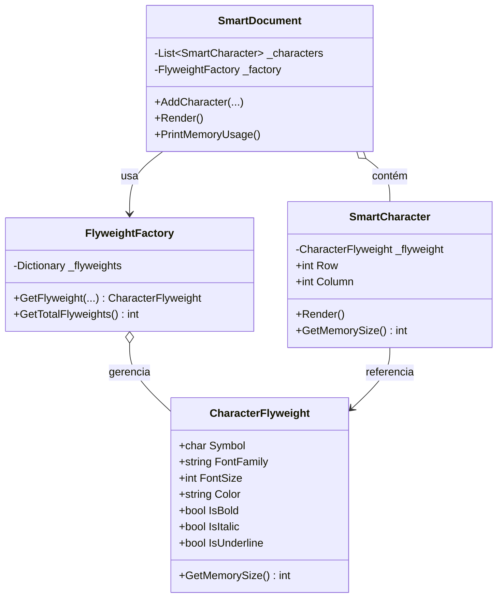

## 🥁 CarnaCode 2026 - Desafio 11 - Flyweight

Oi, eu sou o Ronaldo e este é o espaço onde compartilho minha jornada de aprendizado durante o desafio **CarnaCode 2026**, realizado pelo [balta.io](https://balta.io). 👻

Aqui você vai encontrar projetos, exercícios e códigos que estou desenvolvendo durante o desafio. O objetivo é colocar a mão na massa, testar ideias e registrar minha evolução no mundo da tecnologia.

### Sobre este desafio
No desafio **Flyweight** eu tive que resolver um problema real implementando o **Design Pattern** em questão.
Neste processo eu aprendi:
* ✅ Boas Práticas de Software
* ✅ Código Limpo
* ✅ SOLID
* ✅ Design Patterns (Padrões de Projeto)

## Problema
Um editor de texto precisa renderizar milhões de caracteres, cada um com propriedades de formatação (fonte, tamanho, cor, estilo). Criar um objeto para cada caractere consome memória excessiva e degrada performance.

### Solução: Design Pattern Flyweight
O padrão **Flyweight** permite economizar memória compartilhando partes comuns do estado entre mútiplos objetos. Em vez de armazenar o mesmo dado em milhares de objetos, armazenamos esses dados intrínsecos em um objeto compartilhado.

**Benefícios Observados:**
*   Redução drástica no consumo de memória (~80% de economia estimativa).
*   Melhor uso do Garbage Collector.

## Etapas da Refatoração

1.  **Análise do Código Legado:** Identificação das propriedades repetidas (`FontFamily`, `Color`, etc).
2.  **Criação do Flyweight:** Separação do estado em Intrínseco (`CharacterFlyweight`) e Extrínseco (`SmartCharacter`).
3.  **Implementação da Factory:** Criação da `FlyweightFactory` para garantir a reutilização das instâncias de Flyweight.
4.  **Novo Documento:** Implementação de `SmartDocument` para gerenciar os caracteres otimizados.
5.  **Ponto de Entrada Unificado:** Criação de um `Program.cs` capaz de executar a versão legada e a nova para comparação.

## Estrutura do Projeto

```
balta-desafio-carnacode-2026_11-flyweight/
├── src/
│   ├── Challenge.cs           # Código original (Legado)
│   ├── CharacterFlyweight.cs  # Estado Intrínseco (Compartilhado)
│   ├── FlyweightFactory.cs    # Fábrica de Flyweights
│   ├── SmartCharacter.cs      # Contexto (Estado Extrínseco + Referência)
│   ├── SmartDocument.cs       # Documento Otimizado
│   └── Program.cs             # Runner e Comparador
├── balta-desafio-carnacode-2026_11-flyweight.csproj
└── README.md
```

## Diagrama de Classes



## Sobre o CarnaCode 2026
O desafio **CarnaCode 2026** consiste em implementar todos os 23 padrões de projeto (Design Patterns) em cenários reais. Durante os 23 desafios desta jornada, os participantes são submetidos ao aprendizado e prática na idetinficação de códigos não escaláveis e na solução de problemas utilizando padrões de mercado.

### eBook - Fundamentos dos Design Patterns
Minha principal fonte de conhecimento durante o desafio foi o eBook gratuito [Fundamentos dos Design Patterns](https://lp.balta.io/ebook-fundamentos-design-patterns).

### Veja meu progresso no desafio
[Repositório Central](https://github.com/ronaldofas/balta-desafio-carnacode-2026-central?tab=readme-ov-file)
